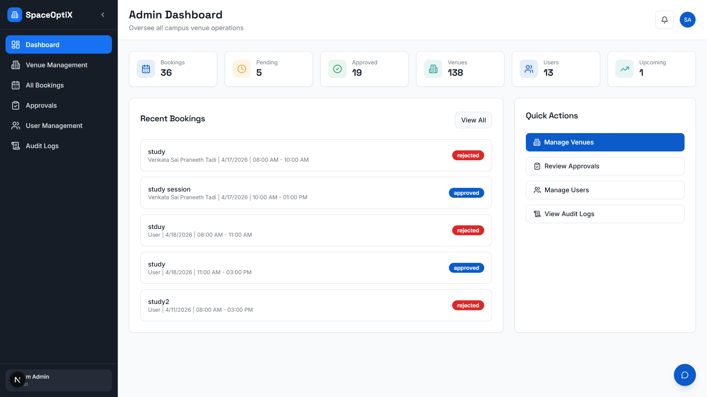
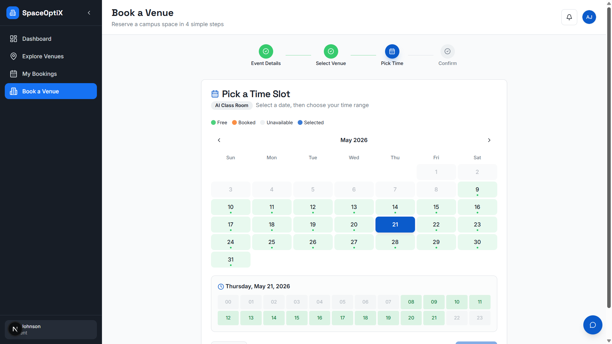

# SpaceOptiX v2

> A comprehensive space booking and venue management platform that streamlines room reservations and facility operations.

### 🌐 [Live Demo → spaceoptix.vercel.app](https://spaceoptix.vercel.app/)


SpaceOptiX offers a highly responsive dashboard, robust approval workflows, and administrative management tools — built for institutions that need intelligent, auditable space optimization.
 
---
 
## Features
 
- **Venue Management:** Bulk CSV import for venues, detailed venue configurations, and real-time availability tracking.
- **Booking & Approval Workflows:** Hierarchical approval system (Professor/Admin) with comment support on rejections and approvals.
- **Smart Dashboard:** "My Bookings" view with detailed audit logs, readable formatting, and real-time status tracking.
- **Intelligent Assistant:** Built-in chatbot with markdown rendering for enhanced user support.
- **User Management:** Profile management, role-based access control, and dropdown navigation.
- **Notification System:** Email notifications via Mailgun to keep users informed at every booking stage.

---
 
## Screenshots
 
| Admin Dashboard | Venue Booking Flow |
| :---: | :---: |
|  |  |
 
---
 
## Technology Stack
 
| Layer | Technology |
|---|---|
| Framework | [Next.js](https://nextjs.org/) (App Router, Turbopack) |
| Language | [TypeScript](https://www.typescriptlang.org/) |
| Database | [MongoDB](https://www.mongodb.com/) |
| Authentication | Custom JWT with `bcryptjs` |
| Styling | [Tailwind CSS](https://tailwindcss.com/) |
| UI Components | [Radix UI](https://www.radix-ui.com/) & [shadcn/ui](https://ui.shadcn.com/) |
| Email / Notifications | [Mailgun](https://www.mailgun.com/) |
 
---
 
## Getting Started
 
### Prerequisites
 
- Node.js v22+
- `pnpm` (project uses `pnpm-lock.yaml`)
- MongoDB instance (local or [Atlas](https://www.mongodb.com/atlas))

### Installation
 
1. **Clone the repository:**
   ```bash
   git clone https://github.com/CrimsonKING3800/SpaceOptiX-v2.git
   cd SpaceOptiX-v2
   ```
 
2. **Install dependencies:**
   ```bash
   pnpm install
   ```
 
3. **Configure environment variables:**
   Copy the example file and fill in your values:
   ```bash
   cp .env.example .env.local
   ```
 
   | Variable | Description |
   |---|---|
   | `NODE_ENV` | Environment mode (`development` or `production`) |
   | `MONGODB_URI` | Your MongoDB connection string |
   | `JWT_SECRET` | Secret key for signing JWT tokens |
   | `GEMINI_API_KEY` | Google Gemini API key for the built-in chatbot |
   | `MAILGUN_API_KEY` | Mailgun API key for email notifications |
   | `MAILGUN_DOMAIN` | Your Mailgun sending domain |
   | `MAILGUN_BASE_URL` | Mailgun base API URL (e.g. `https://api.mailgun.net`) |
   | `MAIL_FROM` | Sender name and email for outgoing notifications |
   | `NEXT_PUBLIC_APP_URL` | Base URL of the app (e.g. `http://localhost:3000`) |
   | `OTP_EXPIRY_SECONDS` | How long (in seconds) an OTP remains valid (e.g. `600`) |
   | `OTP_RESEND_BLOCK_SECONDS` | Cooldown (in seconds) before a user can resend an OTP (e.g. `60`) |

4. **Start the development server:**
   ```bash
   pnpm run dev
   ```
   Open [http://localhost:3000](http://localhost:3000) in your browser.

---
 
## Project Structure
 
```
/
├── app/          # Next.js App Router pages and API routes
├── components/   # Reusable UI components (buttons, dialogs, forms)
├── hooks/        # Custom React hooks for state and data fetching
├── lib/          # Utility functions, DB helpers, and config
└── public/       # Static assets (images, fonts, etc.)
```
 
---
 
## Available Scripts
 
| Script | Description |
|---|---|
| `pnpm run dev` | Start the development server with Turbopack |
| `pnpm run build` | Create a production-optimized build |
| `pnpm run start` | Start the production server |
| `pnpm run lint` | Run ESLint to find and fix code issues |
 
---
 
## Contributing
 
1. Fork the repository
2. Create your feature branch:
   ```bash
   git checkout -b feature/your-feature-name
   ```
3. Commit your changes:
   ```bash
   git commit -m 'feat: add your feature description'
   ```
4. Push to your branch:
   ```bash
   git push origin feature/your-feature-name
   ```
5. Open a Pull Request and tag a maintainer for review

**Branch naming:** `feature/`, `fix/`, or `chore/` prefixes are preferred. PRs should pass lint before requesting review.
 
---
 
## Team
 
| Contributor | GitHub |
|---|---|
| Shaurya Shreyas | [@CrimsonKING3800](https://github.com/CrimsonKING3800) |
| Kumar Sakchham | [@Code-Krasher09](https://github.com/Code-Krasher09) |
| Praneeth Tadi | [@Nobody163107](https://github.com/Nobody163107) |
 
Submitted to **Prof. G Sen**, IIT Kharagpur.
 
---
 
## License
 
This project is submitted for academic purposes at IIT Kharagpur. All rights reserved by the contributors unless otherwise stated.
 
---
 
*Developed for efficient and intelligent space optimization.*
